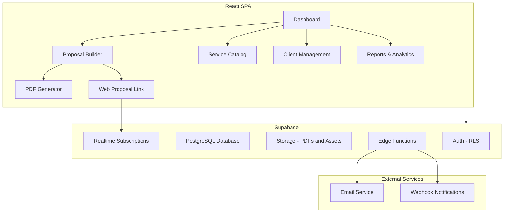
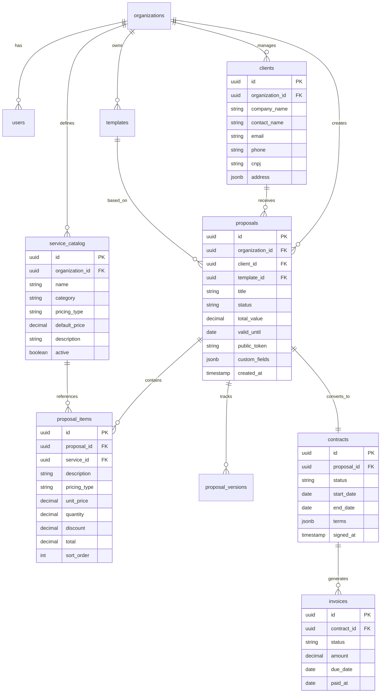
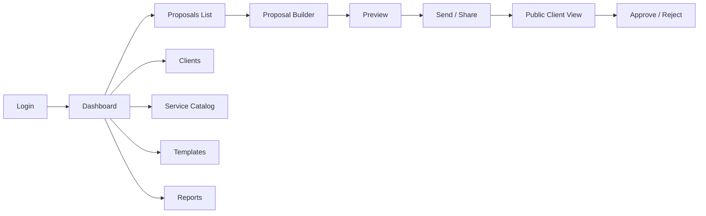

# Budget & Proposal App for Tech Company

## 1. Market Analysis: Existing Tools

### 1.1 Direct Competitors (Proposal/Quote Tools)

| Tool | Strengths | Weaknesses | Pricing |
|------|-----------|------------|---------|
| **PandaDoc** | Templates, e-signatures, CRM integrations, analytics | Expensive for small teams, complex setup | $19-49/user/mo |
| **Proposify** | Beautiful templates, content library, approval workflows | Limited customization, no invoicing | $49/user/mo |
| **Better Proposals** | Clean UI, payment integration, tracking | Limited to proposals only, no Portuguese | $19-49/user/mo |
| **Qwilr** | Interactive web-based proposals, modern design | No offline, expensive | $35-59/user/mo |
| **HoneyBook** | Full client flow (proposal to invoice), automation | Oriented to freelancers, less B2B | $16-66/mo |

### 1.2 Brazilian Market Tools

| Tool | Strengths | Weaknesses | Pricing |
|------|-----------|------------|---------|
| **Proposeful** | Portuguese, Brazilian market focus, simple | Limited features, basic templates | R$49-199/mo |
| **Conta Azul** | Full financial suite, NF-e integration | Not focused on proposals, complex | R$120-300/mo |
| **Bling** | ERP completo, NF-e, financial | Proposal module is basic | R$30-300/mo |
| **Nibo** | Financial management, client portal | No proposal builder | R$50-200/mo |

### 1.3 Gap Analysis - Opportunities

Based on the market analysis, key gaps our app can fill:

1. **Unified Flow**: Most tools are either good at proposals OR invoicing, rarely both
2. **Tech Company Focus**: No tool specifically caters to software/consulting service catalogs with hourly rates, sprint-based pricing, and retainer models
3. **Localization**: Few international-quality tools with proper Portuguese support
4. **Developer-Friendly**: Built with modern tech stack, API-first, extensible
5. **Cost**: Most competitors charge per-user, making scaling expensive

### 1.4 Key Features to Borrow from Market Leaders

- **From PandaDoc**: Document analytics (views, time spent per section)
- **From Proposify**: Content library with reusable blocks
- **From Qwilr**: Interactive web-based proposals (not just PDFs)
- **From HoneyBook**: Unified pipeline from proposal to payment
- **From Better Proposals**: Clean, conversion-optimized templates

---

## 2. Proposed Architecture

### 2.1 Tech Stack

Building on the existing project foundation:

| Layer | Technology | Rationale |
|-------|-----------|-----------|
| Frontend | React 19 + TypeScript + Tailwind CSS | Already in use in the project |
| Build | Vite | Already configured |
| Backend/DB | Supabase (Postgres + Auth + Storage + Edge Functions) | Already integrated, handles auth/storage/realtime |
| PDF Generation | @react-pdf/renderer | React-native PDF creation |
| Email | Resend or Supabase Edge Functions + SMTP | Transactional emails |
| State Management | Zustand or React Context | Lightweight, scalable |
| Forms | React Hook Form + Zod | Type-safe validation |

### 2.2 High-Level Architecture



### 2.3 Database Schema Overview



---

## 3. Feature Modules (Phased Delivery)

### Phase 1: Foundation (MVP)

Core functionality to start generating proposals immediately.

- [ ] **Project Setup**: New app under `apps/budget-app/` with shared config from existing web-app
- [ ] **Authentication**: Supabase Auth with email/password, organization setup
- [ ] **Database Schema**: Core tables with RLS policies per organization
- [ ] **Service Catalog**: CRUD for services with categories and pricing types (hourly, fixed, monthly retainer, per-sprint)
- [ ] **Client Management**: CRUD for clients with company info, contacts, CNPJ
- [ ] **Proposal Builder**: Drag-and-drop sections, add items from catalog, custom items, discounts
- [ ] **PDF Generation**: Professional PDF output with company branding
- [ ] **Public Proposal Link**: Shareable link for clients to view proposals online
- [ ] **Basic Dashboard**: List of proposals with status filters

### Phase 2: Templates & Workflow

Efficiency features for high-volume proposal creation.

- [ ] **Template System**: Save proposals as reusable templates with variable placeholders
- [ ] **Content Library**: Reusable text blocks (scope descriptions, terms, SLAs)
- [ ] **Proposal Status Workflow**: Draft -> Sent -> Viewed -> Approved/Rejected/Expired
- [ ] **Email Notifications**: Send proposals via email with tracking
- [ ] **Proposal Versioning**: Track changes across revisions
- [ ] **Client Portal**: Clients can view, comment, and approve proposals online
- [ ] **Digital Signature**: Simple approval mechanism with timestamp and IP logging

### Phase 3: Analytics & Pipeline

Business intelligence and conversion optimization.

- [ ] **Dashboard Metrics**: Conversion rate, average deal size, time-to-close, revenue pipeline
- [ ] **Proposal Analytics**: View tracking (opened, time per section, number of views)
- [ ] **Pipeline View**: Kanban board of proposals by status
- [ ] **Activity Timeline**: Full history of interactions per proposal
- [ ] **Team Management**: User roles (admin, sales, viewer) with permission levels
- [ ] **Notifications**: Real-time alerts when clients view/approve proposals

### Phase 4: Contract & Invoicing

Full lifecycle management from proposal to payment.

- [ ] **Contract Generation**: Auto-generate contracts from approved proposals
- [ ] **Contract Templates**: Customizable legal templates with merge fields
- [ ] **Invoice Generation**: Create invoices from contracts (one-time or recurring)
- [ ] **Payment Tracking**: Mark invoices as paid, partial payments, overdue alerts
- [ ] **Financial Reports**: Revenue, outstanding, cash flow projections
- [ ] **API & Integrations**: Webhooks, REST API for external system integration

---

## 4. Key Technical Decisions

### 4.1 Proposal Builder Approach

**Recommended: Block-based editor** (similar to Notion/Gutenberg)

- Each proposal section is a "block" (text, service table, image, terms, signature)
- Blocks are stored as JSONB in the database for flexibility
- Renders to both interactive web view and PDF
- Easier to template and reuse than free-form editors

### 4.2 PDF Generation Strategy

**Recommended: Dual rendering**

1. **Web view** (primary): Interactive React components via public shareable link
2. **PDF export**: `@react-pdf/renderer` generates PDF on-demand using the same data
3. Share the web link by default (trackable), offer PDF download as secondary option

### 4.3 Multi-tenancy via Supabase RLS

- Organization-based isolation using Row Level Security
- Every table has `organization_id` column
- RLS policies ensure users only see their organization's data
- No application-level filtering needed -- security at database level

### 4.4 Pricing Model Types for Tech Services

The service catalog should support these pricing models common in tech companies:

| Type | Example | Fields |
|------|---------|--------|
| **Hourly** | Consultoria tecnica | Rate/hour x estimated hours |
| **Fixed** | Desenvolvimento de landing page | Fixed price |
| **Monthly Retainer** | Suporte e manutencao | Monthly rate x duration |
| **Per Sprint** | Desenvolvimento agil | Sprint price x number of sprints |
| **Custom** | Projeto especial | Free-form pricing |

---

## 5. UI/UX Design Principles

Based on market analysis, the winning formula includes:

1. **Clean, professional appearance** -- the proposal IS your brand
2. **Speed to create** -- under 5 minutes for a new proposal from template
3. **Mobile-responsive client view** -- clients read proposals on phones
4. **Minimal clicks** -- quick actions for common tasks
5. **White-label ready** -- company logo, colors, custom domain (future)

### Key Screens



---

## 6. File Structure

```
apps/budget-app/
  src/
    components/
      ui/                    # Shared UI components - buttons, inputs, modals
      layout/                # App shell, sidebar, header
      proposal-builder/      # Block editor, item table, section components
      pdf/                   # PDF template components
    pages/
      Dashboard.tsx
      Proposals.tsx
      ProposalBuilder.tsx
      ProposalPreview.tsx
      PublicProposal.tsx     # Public shareable view - no auth required
      Clients.tsx
      ClientDetail.tsx
      ServiceCatalog.tsx
      Templates.tsx
      Reports.tsx
      Settings.tsx
    hooks/
      useProposals.ts
      useClients.ts
      useServices.ts
      useTemplates.ts
      useOrganization.ts
      useAnalytics.ts
    lib/
      supabase.ts
      pdf-generator.ts
      email.ts
    types/
      index.ts              # All TypeScript interfaces
    utils/
      currency.ts           # BRL formatting
      calculations.ts       # Totals, taxes, discounts
      validators.ts         # Zod schemas
    stores/
      proposal-store.ts     # Zustand store for builder state
```

---

## 7. Competitive Advantages of Our Solution

| Advantage | Details |
|-----------|---------|
| **Tech-native pricing** | Built-in support for hourly, sprint, retainer pricing models |
| **No per-user pricing** | Supabase scales by usage, not seats |
| **Full ownership** | Self-hosted, no vendor lock-in on your business data |
| **Modern stack** | React 19, TypeScript, Tailwind -- fast and maintainable |
| **Dual format** | Interactive web proposals with PDF fallback |
| **Brazilian market ready** | Portuguese, BRL, CNPJ fields, NF-e integration path |
| **API-first** | Supabase provides REST and GraphQL APIs out of the box |

---

## 8. Risks and Mitigations

| Risk | Mitigation |
|------|-----------|
| PDF rendering complexity | Start with simple layouts, iterate on design. Use react-pdf which handles most cases well |
| Scope creep across phases | Strict MVP discipline -- Phase 1 must be usable standalone |
| Email deliverability | Use established service like Resend; implement SPF/DKIM |
| Data security | Supabase RLS, encrypted storage, audit logs from Phase 1 |
| Performance with large proposals | Virtualized lists, lazy loading, optimistic updates |
